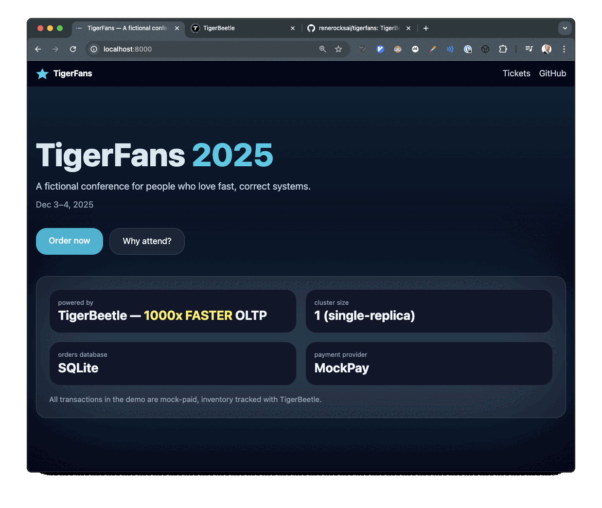

# ⭐ TigerFans

_Resource reservations, payment flows, and consistency — in one clean demo._

TigerFans is a prototype **ticketing system demo** that shows how
**[TigerBeetle](https://tigerbeetle.com)** can be applied beyond financial
transactions. It models a fictional **conference booking system** with a payment
flow:



- **Checkout** creates an order and places a **time-limited hold**
- An **external payment step** decides the outcome
- A **webhook callback** then **finalizes** or **voids** the order

The system demonstrates **time-limited holds** (pending transfers) for tickets
and a **conditional goodie grant**: the ticket is committed on payment success,
and a goodie is granted if goodies are still available

> 💡 This demo is not about benchmarking or raw performance. It’s meant to show
how TigerBeetle fits into a **realistic booking flow**, rather than just an
isolated code snippet. It also highlights how tickets and goodies are modeled as
**TigerBeetle accounts and transfers**, which works very differently from rows
in an SQL table.

### Features

- **Two ticket classes** (A: Premium, B: Standard), **one ticket per order**.
- **Time-limited holds** via **pending TigerBeetle transfers**; finalized on
  payment success or **voided on timeout/failure**.
- 🎁 **Goodie unlocks**: first 100 paid orders, granted with the ticket.
- **MockPay** provider with **redirect + webhook** flow (no real payments).
- **FastAPI** backend; **SQLite** for app state (orders, payments).
- **Admin dashboard** (basic, protected by HTTP Basic Auth)
-  **UI pages**: landing, checkout, success incl. QR-code download

**See [doc/tigerbeetle.md](doc/tigerbeetle.md) for more details about how we
model TigerBeetle accounts and transfers.**

## First-time setup

* download and unzip [Tigerbeetle](https://tigerbeetle.com) into this directory.
See [here](https://tigerbeetle.com/#install) how to.

### Create environment for python

```console
$ python3 -m venv venv
$ source venv/bin/activate
$ pip install -r requirements.txt
```

## Start TigerFans:

### Start TigerBeetle

```console

# init and start tigerbeetle
$ ./start_tigerbeetle.sh
```

### Start the server

With Tigerbeetle running:

```console
$ uvicorn tigerfans.server:app --reload --port=8000
```
Connect your browser to [http://localhost:8000/](http://localhost:8000).

To see the last 200 orders, go to
[http://localhost:8000/admin](http://localhost:8000/admin) and log in with
username `admin` and password `supasecret`.


## Run the demo in docker

> ⚠️ Works on macOS (M3 tested), but not on AWS due to io_uring limitations in
> Docker.

```console
$ docker-compose up --build
```
Wait for the app to start:

```
app-1  | INFO:     Application startup complete.
```

Then connect your browser to [http://localhost:8000/](http://localhost:8000).

To see the last 200 orders, go to
[http://localhost:8000/admin](http://localhost:8000/admin) and log in with
username `admin` and password `supasecret`.
